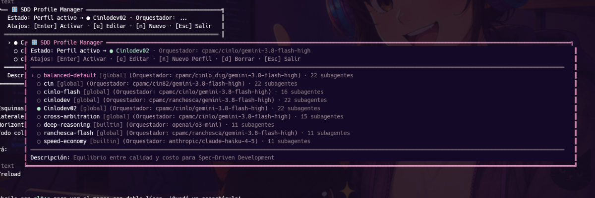
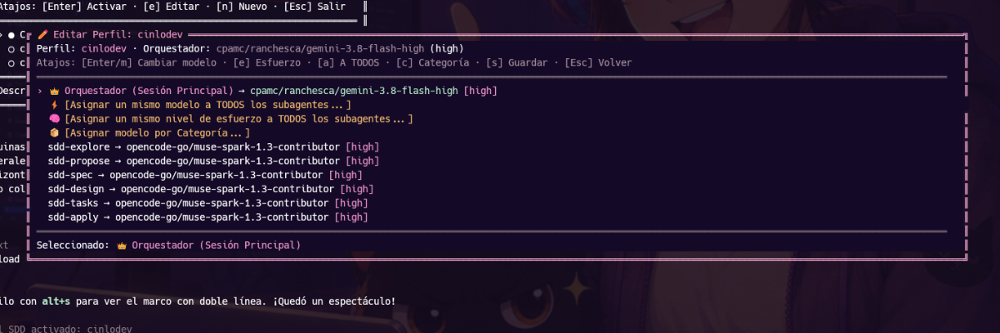
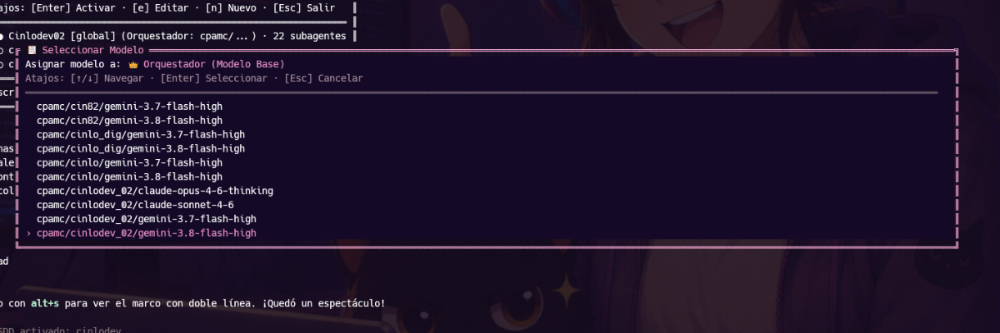

# pi-sdd-profiles 🎛️

Extensión nativa para **Pi Coding Agent** para crear, guardar, versionar y alternar perfiles de modelos de IA para **Spec-Driven Development (SDD)** y subagentes en caliente.

Se integra de forma transparente y atómica con [`pi-subagents-j0k3r`](https://github.com/j0k3r-dev-rgl/pi-subagents-j0k3r), actualizando las asignaciones de modelos en `subagents.json` sin alterar timeouts, atajos de teclado ni herramientas configuradas.

<p align="center">
  
</p>

---

## Características

- 🪟 **Ventana Flotante Modal Interactiva**: Se abre centrada en la terminal (`alt+s` o `/sdd-profile`) sin borrar el historial ni salir del contexto.
- ⚡ **Cambio en caliente**: Alterná perfiles y sincronizá el modelo de sesión y los subagentes al instante.
- 📦 **Perfiles Estándar Incluidos**:
  - `balanced-default`: Equilibrio entre calidad y costo con Claude Sonnet 4.5 y Claude Haiku 4.5.
  - `deep-reasoning`: Máximo nivel de razonamiento (`max`/`high`) con OpenAI o3-mini en fases críticas de diseño y revisión.
  - `speed-economy`: Velocidad y costo mínimo para tareas ligeras e iteraciones directas.
- 🎨 **Cockpit Visual y Editor en Pantalla**: Navegá con flechas (`↑`/`↓`), activá con `Enter`, editá con `e`, asigná modelos por lote con `a` o `c`, y guardá con `s`.
- 📋 **Descubrimiento Automático de Modelos**: Despliega todos los modelos configurados en tu Pi (`cpamc/...`, `opencode-go/...`, locales o remotos) sin escribir nada a mano.
- 🛡️ **Escritura Atómica Segura**: Preserva 100% de la configuración de `subagents.json` (`timeout_ms`, `history_panel_shortcut`, `default_tools`, etc.) y previene escrituras corruptas vía archivos temporales y renombrado atómico.
- 🌐 **Soporte Global y por Proyecto**: Tus perfiles personalizados se guardan localmente en `~/.pi/agent/profiles/` (globales) o en `.pi/profiles/` (del proyecto).
- 🧠 **Skill Incluida**: Provee la skill `sdd-profiles` para que el orquestador y los agentes sepan gobernar y sugerir perfiles.
- 🤖 **Herramientas para el Orquestador**: Expone `sdd_profile_list` y `sdd_profile_switch` como tools para que el orquestador pueda conmutar perfiles programáticamente cuando una fase lo requiera.

---

## Controles en la Ventana Flotante (`alt+s`)

### Vista Principal (Lista de Perfiles)
- `↑` / `↓` o `j` / `k`: Moverse entre los perfiles disponibles.
- `Enter`: Activar el perfil seleccionado (actualiza subagentes y modelo de sesión).
- `e`: Abrir el editor de modelos del perfil seleccionado.
- `d`: Borrar perfil personalizado. 
- `Esc` o `q`: Cerrar la ventana flotante.

### Vista de Edición (`e` dentro de un perfil)
- `↑` / `↓`: Navegar por la lista de agentes.
- `Enter` o `m`: Abrir selector flotante de modelos para el agente seleccionado.
- `e`: Cambiar el nivel de esfuerzo de razonamiento.
- `a`: Asignar un modelo a **TODOS** los agentes del perfil en un solo paso.
- `c`: Asignar un modelo a una **Categoría** entera (Núcleo SDD, Judgment Day, Revisores).
- `s`: Guardar los cambios del perfil.
- `Esc`: Volver a la lista de perfiles.

<p align="center">
  
</p>

---

### Selector Desplegable de Modelos
Al asignar un modelo a cualquier agente o categoría, se abre la lista flotante con todos los modelos disponibles en tu entorno:

<p align="center">
  
</p>

---

## Comandos

| Comando | Descripción |
|---|---|
| `/sdd-profile` | Abre el selector interactivo nativo en terminal. Incluye la opción para crear nuevos perfiles. |
| `/sdd-profile apply <nombre>` | Activa directamente un perfil por su nombre. Agregá `--project` para aplicarlo solo localmente. |
| `/sdd-profile create <nombre> [modelo] [effort]` | Crea un nuevo perfil. Si omitís los argumentos, inicia el asistente guiado. |
| `/sdd-profile save <nombre> [desc]` | Captura la configuración actual de `subagents.json` y la guarda como un nuevo perfil reutilizable. |
| `/sdd-profile set <perfil> <agente> <modelo> [effort]` | Asigna o modifica el modelo de un agente específico dentro de un perfil. |
| `/sdd-profile list` | Muestra en el chat el listado completo de perfiles disponibles y sus scopes. |
| `/sdd-profile show <nombre>` | Muestra el desglose detallado de modelos asignados por categoría (Núcleo SDD, Judgment Day, Revisores, etc.). |
| `/sdd-profile delete <nombre>` | Elimina un perfil personalizado creado por el usuario. |

### Atajo de teclado
- `alt+s`: Abre de inmediato el menú selector de perfiles.

---

## Estructura de un Perfil (`*.json`)

```json 
{
  "name": "mi-perfil",
  "description": "Configuración personalizada para desarrollo rápido",
  "default_model": "anthropic/claude-sonnet-4-5",
  "default_effort": "high",
  "model_profiles": {
    "sdd-explore": { "model": "anthropic/claude-haiku-4-5", "effort": "low" },
    "sdd-propose": { "model": "anthropic/claude-sonnet-4-5", "effort": "high" },
    "sdd-apply": { "model": "anthropic/claude-sonnet-4-5", "effort": "high" },
    "jd-judge-a": { "model": "anthropic/claude-sonnet-4-5", "effort": "high" },
    "jd-judge-b": { "model": "openai/o3-mini", "effort": "high" }
  }
}
```

---

## Instalación en Pi

### Opción 1: Enlace directo a extensiones globales de Pi
```bash
ln -s $(pwd) ~/.pi/agent/extensions/pi-sdd-profiles
```
O simplemente cargándolo al iniciar Pi:
```bash
pi -e /home/cinlodev/projects/experiments/pi-sdd-profiles/index.ts
```

### Opción 2: Como paquete local
```bash
pi install file:/home/cinlodev/projects/experiments/pi-sdd-profiles
```

---

## Tests

El proyecto cuenta con suite completa de tests unitarios:
```bash
pnpm test
pnpm typecheck
```

## Licencia
MIT
